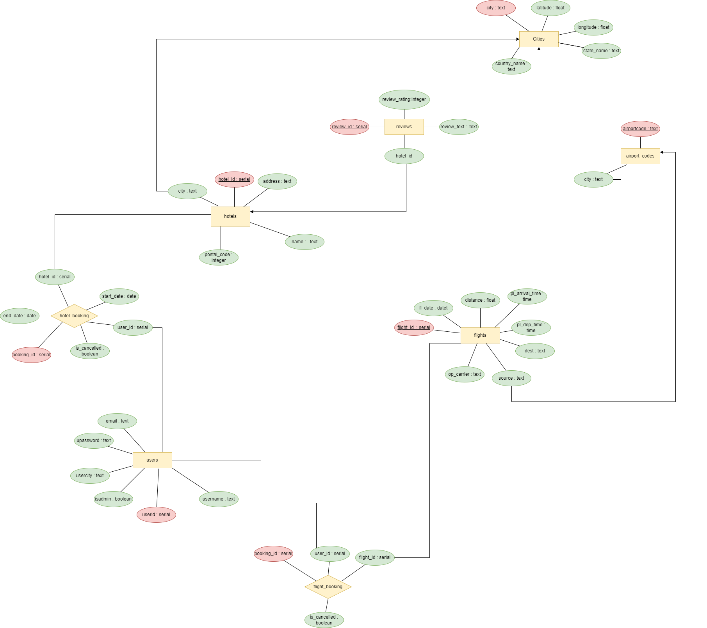

Apologies for the incorrect information. Here's the updated version of the readme.md file with the correct information regarding the database library used:

# EaseMyTrip

EaseMyTrip is a comprehensive web application built using Flask Framework and PostgreSQL database. It provides users with a convenient and user-friendly platform for flight and hotel bookings. This repository contains the source code and files for the EaseMyTrip application.

## Features

- Flight Booking: Users can search and book flights from a wide range of options, including different airlines, departure times, and prices.
- Hotel Booking: Users can explore and reserve hotel accommodations based on their preferences, such as location, ratings, and amenities.
- User Authentication: Secure user registration and login system to ensure data privacy and personalized experiences.
- Seamless Integration: The application seamlessly integrates flight and hotel bookings, allowing users to plan their entire trip in one place.
- User Dashboard: Users can manage their bookings, view past and upcoming trips, and access essential travel information.
- Optimized Performance: Efficient database schema design, query optimization techniques, and indexing to ensure fast and reliable application performance.
- Responsive Design: The application is designed to be responsive, providing an optimal viewing experience across different devices and screen sizes.

## ER Diagram

- This is ER-Diagram of the database, we have created for this application

## Technologies Used

- Flask Framework: A powerful Python web framework used for building the application's backend.
- PostgreSQL: A robust and scalable open-source relational database management system used for storing and retrieving data.
- HTML, CSS, JavaScript: Frontend technologies used for designing and enhancing the user interface.
- Psycopg2: A PostgreSQL adapter for Python, used for database interactions.
- Bootstrap: A popular CSS framework used for creating responsive and visually appealing web pages.

## Getting Started

To run the EaseMyTrip application locally, follow these steps:

1. Clone the repository: `git clone https://github.com/AkshatGadhwal/EaseMyTrip.git`
2. Install the required dependencies: `pip install -r requirements.txt`
3. Set up the PostgreSQL database and update the database configurations in the `config.py` file.
4. Start the server: `flask run`
5. Access the application in your web browser: `http://localhost:5044`

## Contributions

Contributions to the EaseMyTrip project are welcome. If you encounter any issues or have suggestions for improvements, please feel free to open an issue or submit a pull request.

## License

This project is licensed under the [MIT License](LICENSE).

## Acknowledgements

- The developers and contributors of Flask, PostgreSQL, and other open-source libraries used in this project.
- The community of developers and users who have provided support and feedback throughout the development process.

Enjoy using EaseMyTrip for hassle-free flight and hotel bookings!